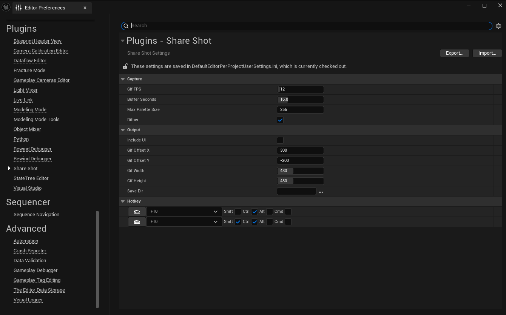

# 📘 Share Shot

**Share Shot is a lightweight Unreal Engine plugin designed to make sharing your development progress simple and fast.**  

With just a single click, you can record gameplay or editor footage directly into GIF format – perfect for showcasing bugs, features, or quick highlights without external tools.

Whether you’re preparing material for social media, team discussions, or bug reports, Share Shot helps you create clean GIF captures right inside the editor.  
No setup hassle, no extra software required – just record and share.

---

## 🚀 Usage

### ▶️ Hotkeys
- **Toggle Gif Recording** *(Default: `Ctrl + F10`)*  
  Start/stop GIF recording.
- **Toggle Show Region Overlay** *(Default: `Ctrl + Shift + F10`)*  
  Toggle the capture region overlay on/off.

### ▶️ Console Commands

| Command                          | Description |
|----------------------------------|-------------|
| `ShareShot.StartGifRecording`    | Start recording a GIF. |
| `ShareShot.StopGifRecording`     | Stop recording and save the GIF. |
| `ShareShot.ShowRegionOverlay`    | Manually show the capture region overlay. |
| `ShareShot.HideRegionOverlay`    | Manually hide the capture region overlay. |

💡 *Tip: You can run commands in the UE console (`~`) or bind them to custom hotkeys.*  

---

## 🎯 Current Features
- 🔴 Record high-quality GIFs directly from the Unreal Editor  
- 🎯 Capture both PIE (Play In Editor) and editor windows  
- ⌨️ Start/stop recording with a hotkey and console command  
- ⚡ Quick and simple workflow designed for developers and creators  

---

## ⚙️ Settings
You can configure Share Shot in **Editor Preferences → Plugins → Share Shot**.

### 📸 Capture
- **GIF FPS** *(8–60, default: 12)*  
  Frames per second for capture. Higher values = smoother animation but larger file size.
- **Max Record Length (BufferSeconds)** *(1–60s, default: 16)*  
  Maximum recording duration. Recording stops automatically at this limit.
- **Max Palette Size** *(default: 256)*  
  Maximum number of colors in the GIF palette. Lower values reduce file size but may lower quality.
- **Dither** *(default: true)*  
  Apply dithering when reducing colors. Helps preserve detail but may introduce noise.

### 🖼 Output
- **Include UI** *(default: false)*  
  Include Slate/HUD UI elements in the capture. If disabled, only the scene render is recorded.
- **GIF Width / Height** *(16–1280, default: 480x480)*  
  Output resolution of the GIF. Cannot exceed viewport size.
- **Save Directory** *(default: `<Project>/Saved/ShareShot`)*  
  Directory where GIFs are saved.  
  - A subfolder with the current date (YYYYMMDD) is created automatically.  
  - Example: `<Project>/Saved/ShareShot/20250901/ShareShot_20250901_145607.gif`

### ⌨️ Hotkey
- **Toggle Gif Recording** *(Default: `Ctrl + F10`)*  
  Hotkey to start/stop GIF recording.  
- **Toggle Show Region Overlay** *(Default: `Ctrl + Shift + F10`)*  
  Hotkey to toggle the capture region overlay on/off.  

---

## 🛠 Support
- Please use the GitHub **Issues** tab for bug reports and feature requests.  
- Contact: **TidyFactory.dev@gmail.com**  

---
